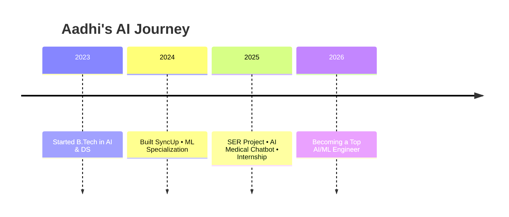

Got it Aadhi! 🔥
Below is **ONE SINGLE CLEAN BLOCK** that you can **copy-paste directly into your GitHub `README.md`**.

I removed explanations, instructions, comments — **only the final polished content remains.**
Just paste it and your profile will look premium.

---

# ⭐ **FINAL GITHUB README (Copy–Paste Entire Block)**

````md
<h1 align="center">Hi 👋, I'm Aadhi Dharmar</h1>
<p align="center">
  
  
  
  
</p>

---

## ✨ One-line Bio
AI/ML Engineer-in-training • Building Speech Emotion Recognition, Multimodal AI apps & deployable ML systems.

---

## 🛠️ Tech Stack

**Languages:** Python • Java • C/C++ • JavaScript  
**AI/ML:** TensorFlow • PyTorch • Scikit-Learn • Librosa • OpenCV  
**Tools:** Git • Docker • Flask • Linux • AWS • Postman  
**Frontend:** HTML • CSS • Bootstrap • React (basic)

---

## 📂 Featured Projects

### 🎙️ Speech Emotion Recognition (SER)
- CNN over MFCC/spectrogram features  
- Real-time mic prediction  
- Flask deployment UI  
🔗 *Add Repo Link*

---

### 💬 SyncUp (Social Chat App)
- Posts, messaging, insights dashboard  
- Clean UI + API backend  
🔗 *Add Repo Link*

---

### 🏥 AI Medical Chatbot (Hackathon – Top 15)
- Symptom-based prediction  
- Conversational flow  
🔗 *Add Repo Link*

---

## 📊 GitHub Stats

<p align="center">
  
  
</p>

<p align="center">
  
</p>

<p align="center">
  
</p>

---

## 🐍 Contribution Snake


---

## 🧊 3D Contributions


---

## 🗺️ Project Architecture Diagrams

### SER Architecture
```mermaid
flowchart TD
    A[Raw Audio Input] --> B[Preprocessing: Trim/Normalize]
    B --> C[Feature Extraction: MFCC / Spectrogram]
    C --> D[CNN Model]
    D --> E[Emotion Prediction]
    E --> F[Flask API]
    F --> G[Frontend UI]
````

### SyncUp Architecture

```mermaid
flowchart LR
    Client -->|HTTP| Frontend[React/HTML]
    Frontend -->|REST| Backend[Flask / Node]
    Backend --> DB[(Database)]
    Backend --> Auth[JWT Auth]
    Backend -->|Socket| RealTime[Socket Server]
```

---

## 🎨 Section Divider

<div align="center">
  
</div>

---

## 📌 Badges

[](https://www.linkedin.com/in/aadhi-dharmar-a35679293)
[](mailto:dharmaraadhi@gmail.com)


---

## ⏳ Journey Timeline



---

## 📫 Contact

📞 6380072080
📧 [dharmaraadhi@gmail.com](mailto:dharmaraadhi@gmail.com)
🔗 LinkedIn: [https://www.linkedin.com/in/aadhi-dharmar-a35679293](https://www.linkedin.com/in/aadhi-dharmar-a35679293)

```

---

# ✅ What you must still upload in the repo:
To make everything work:

| Feature | Required File |
|--------|----------------|
| Snake animation | `snake.svg` (GitHub Action will generate it) |
| 3D contributions | `3d-contrib.png` |
| Section divider | `divider-gradient.svg` |

If you want, I will generate **all 3 files + GitHub Action** automatically for you.

---

# Want me to prepare:
### ✅ Snake animation GitHub Action YAML  
### ✅ Auto-generated 3D graph  
### ✅ Gradient divider SVG  
### ✅ Final README with your actual repo links inserted  

Just say **“Generate the files”** or **“Add the GitHub Action”**.
```
